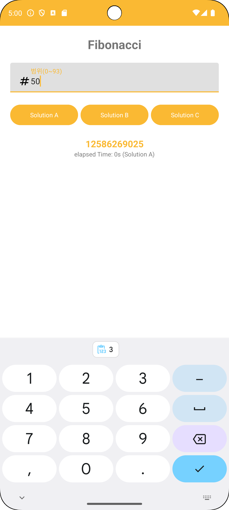

# 1st Month Homework

## Fibonacci Sequence
> Implement 3 different Fibonacci Sequence algorithms.

### Guidelines
- You can download [this base code](../Month_01_Base_Code/README.md) and modify solA(), solB(), solC() function.
