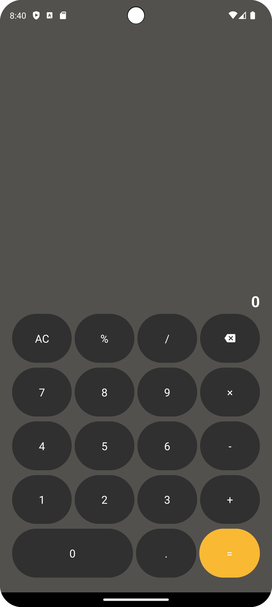

# Week 2 Homework

    
    

## Calculator
> Create your own Calculator Application using Android Studio.

### UI
- You can design your own User Interface.
- Your UI must have 'AC', '%', '/', 'backspace', '*', '-', '+', '=', '.' and '0~9' buttons.
- Your UI must have 'Result' and 'Expressions' TextView.

### Features
> 기본 기능
- 모든 버튼에 대한 기능을 제공해야합니다.
- 처음 계산기를 실행하면, 수식은 비어있고, 결과의 초기값은 0으로 설정합니다.
- 숫자를 입력하면 초기값 0에서 입력한 숫자로 변경하고, 수식란에는 입력한 숫자가 표시됩니다.
<i>c.f. 초기값에서 2를 누른 경우 0 → 2로 결과값 변경, 수식에는 '2' 표기</i>

> 연산자 클릭 시
- 숫자가 하나인 상태에서 연산자를 눌렀을 경우:
<b>수식란에 연산자 표기</b>
<i>c.f. '2'를 누른 상태에서 연산자 '+'를 누른 경우 수식에는 '2+'표기</i>

- 숫자가 두개인 상태에서 연산자를 눌렀을 경우:
<b>앞 수식을 먼저 계산하고 결과는 계산 결과 표기</b>
<i>c.f. '2+2'인 상태에서 연산자 '+'를 눌렀을 경우 수식에는 '4+', 결과는 '4' 표기</i>

- 나눗셈에서 두번째 숫자가 0인 경우:
<b>수식을 비우고, 결과를 0으로 초기화</b>
<i>c.f. '2/0'인 경우 수식을 비우고, 결과를 '0'으로 초기화</i>

- 수식의 마지막 글자가 숫자가 아닌 연산자인 경우:
<b>기존 연산자를 제거하고 새로운 연산자로 대체</b>
<i>c.f. '2+1+'인 상태에서 연산자 '-'를 눌렀을 경우 수식은 '2+1-'가 되어야 함.</i>

> 백스페이스 클릭 시
- 수식의 마지막 글자가 숫자인 상태에서 백스페이스를 눌렀을 경우:
<b>마지막 글자 하나 삭제 후 수식, 결과값 반영</b>
<i>c.f. '21'인 상태에서 백스페이스를 눌렀을 경우 수식과 결과 모두 '2'가 되어야 함.</i>

- 수식의 마지막 글자가 연산자인 상태에서 백스페이스를 눌렀을 경우:
<b>연산자 삭제</b>
<i>c.f. '2+'인 상태에서 백스페이스를 눌렀을 경우 수식은 '2', 결과값은 '2'가 그대로 유지되어야 함.</i>
