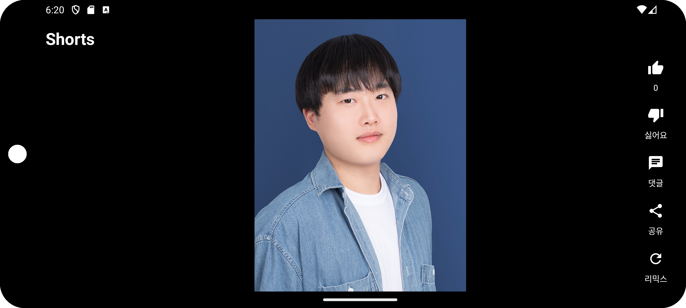

# 3rd Week Homework

## Shorts
> Create your Shorts Application using Android Studio.

### UI
- YouTube Shorts의 UI를 참고하여 세로형 UI를 최대한 비슷하게 만드세요. 
- 가로형 UI도 제공해야합니다. 

### Features
> 기본 기능
- n장의 이미지를 준비하고, <b>ImageView를 LongClick할 경우 이미지를 다음 이미지로 변경</b>합니다. 
- 마지막 이미지가 표시된 상태에서 ImageView를 LongClick할 경우 <b>이미지를 첫번째 이미지로 변경</b>합니다. 
- ImageView를 <b>두번 클릭하면 좋아요 수가 '1' 증가</b>합니다. (<b>단, 이미 한번 증가된 경우 증가하지 않습니다.</b>) 
<i>c.f. 좋아요 수가 '0'인 상태에서 ImageView를 두번 클릭하면 '1'이 됩니다. 단, '1'이 된 상태에서 두번 클릭하면 '1'이 그대로 유지되어야 합니다.</i> 
- '좋아요' 버튼을 클릭하면 <b>좋아요 수가 '1' 증가</b>합니다. 단, <b>이미 한번 증가한 경우 '1' 감소</b>시킵니다. 
- '좋아요' 버튼의 <b>텍스트는 좋아요 수</b>로 표시합니다. 
- 기기를 회전시키면 <b>가로모드 UI</b>를 제공합니다. 
- '좋아요' 수는 <b>다른 이미지로 전환된 후 다시 돌아오더라도 유지</b>되어야 합니다. 
<i>c.f. 좋아요 수가 '1'인 이미지 A에서 이미지 B로 전환된 후 다시 이미지 A로 돌아오더라도 좋아요 수는 '1'이여야합니다.</i> 

### Source Code
- 변수 이름은 <b>해당 변수의 역할을 잘 나타내도록 작명</b>할 것. 
<i>c.f. a, b, c ... (X), btn_add, btn_multiply ... (O)</i> 
- <b>가변, 불변 타입을 변수의 역할에 따라 적절히</b> 사용할 것. 
<i>(변수의 값이 변하지 않는데 가변 타입 사용 시 감점 처리함.)</i> 
- <b>접근 제한자를 함수 및 변수의 사용처에 따라 적절히</b> 사용할 것. 
<i>(사용처에 따라 감점처리함.)</i>
- DataBinding의 사용을 권장하나, 필수는 아님.
