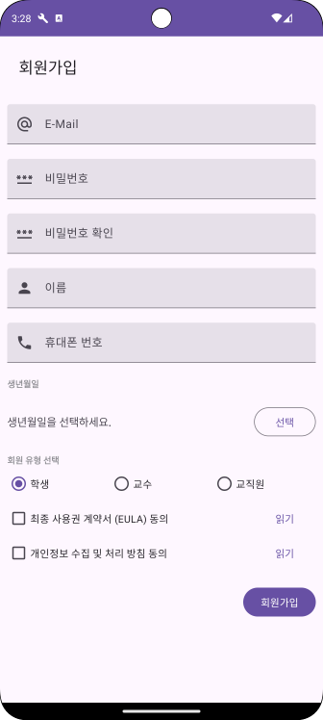
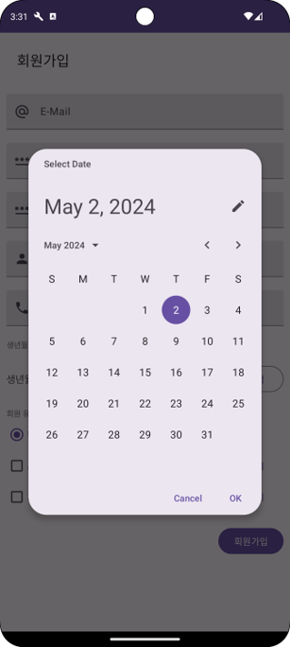
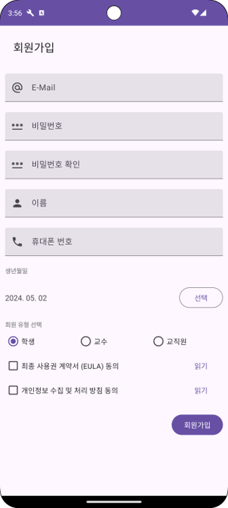
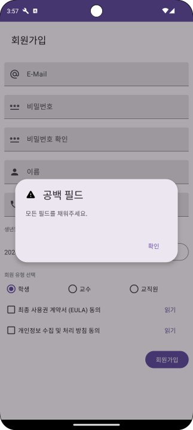
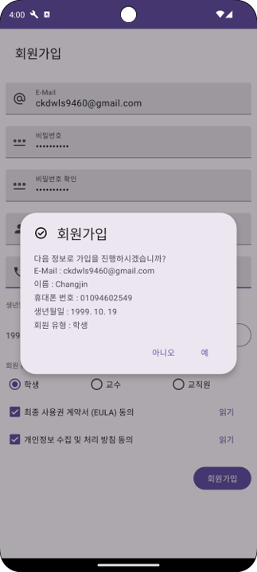
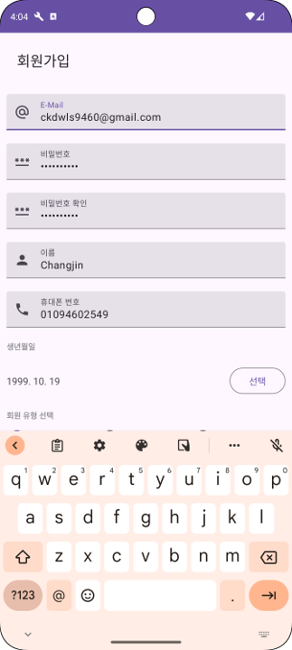

# 4th Week Homework

## Sign Up
> Create Fully-implemented Sign Up UI using Android Studio.

### UI
- You should request E-Mail, Password, Confirm Password, Name, Phone number, Bitrhday, User Type. 
- User types should be implemented in Radio Button so that users can choose from them. 
- Use Check Boxes to request consent to the final license agreement and privacy collection and processing policy. 

### Features
> Birthday 

 

- Display the Date Picker Dialog when the 'Select' button is tapped in the date of birth field. 
- When you tap the Cancel button on the DatePicker Dialog, close it. 
- When you tap the OK button on the DatePicker Dialog, change the 'Select Date of Birth' TextView to the selected date of birth. 

> Sign Up button 

- If one or more of E-Mail, password, confirm password, name, contact information, or date of birth is blank:
<b>Display the dialog that says, 'Fill in all fields.'</b>  

- If E-Mail does not have the '@' symbol:
<b>Display the dialog that says, 'This is an incorrect format of E-Mail.'</b>  

- If the password is less than 8 digits long:
<b>Display the dialog that says, 'Please set a password of at least 8 digits for security.'</b>  

- If password and password verification do not match:
<b>Display the dialog that says, 'Password and password verification do not match.'</b>  

- If you do not agree to one or more of the final license aggrements, privacy collection and processing policies:
<b>Display the dialog that says, 'Please read and agree to the final license agreement and the privacy collection and processing policy.'</b>  

- If all conditions are met:
<b>Display the personal information entered by the user on the Dialog with the message, 'Do you want to proceed with the subscription with the following information?' (However, passwords are excluded.)</b> 
<i>If you tap the 'Yes' button, remove the 'Sign up' button from the screen and display the CircularProgressIndicator (but set the value of android:indeterminate in the CircularProgressIndicator to true so that the ProgressBar rotates indefinitely)</i> 
<i>If you tap the 'No' button, just close the dialog.</i> 

### Source Code
 
- Use Enum class to select the membership type. 
- Provide the Keyboard Type of the purpose of EditText. 
<i>For Example, if it is E-Mail, display the appropriate keyboard for E-Mail.
Do not display the value entered if it is a Password, or display a numeric keypad if it is a phone number.</i>