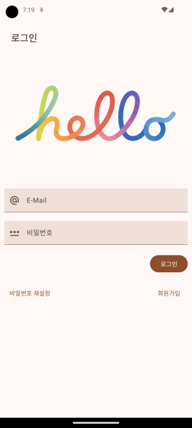
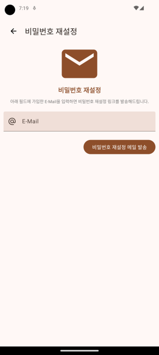
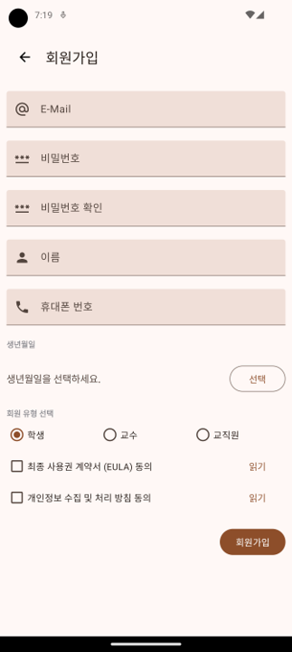
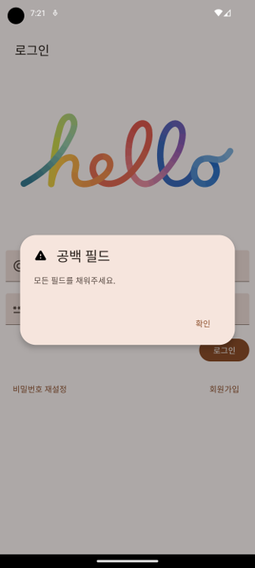
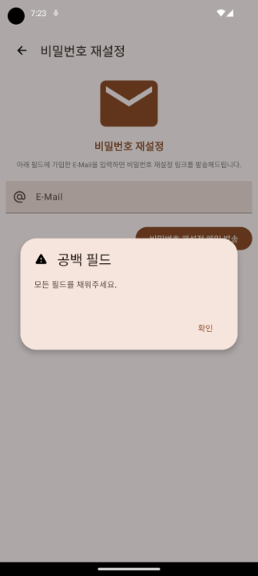

# 5th Week Homework

## Sign In & Sign Up
> Create Fully-implemented User Management UI using Android Studio.

### Common Requirements
 
- Use only one activity and name it 'StartActivity'. 
- Use the ContentView for Activity as a 'layout_start.xml' file and implement it so that only FrameLayout exists for Fragment View display in that XML file. 
- Use Fragment to implement sign in, sign up, and reset password view. 

### Sign In
 

- Sign In View must be the entry point of the app. 
- If any of the E-Mail, Password Text Fields are not entered and the 'sign in' button is tapped, indicate the blank field Alert Dialog. 
- If you tap the 'Reset Password' button, navigate to Reset Password View. 
- If you tap the 'Sign Up' button, navigate to Sign Up View. 

### Reset Password
 

- If you have tapped the 'Send password reset mail' button without E-Mail entered, display the blank field Alert Dialog. 
- Provide a 'back' button in the TopApp Bar, and tap the button to switch to the previous view. 

### Sign Up
 

- Sign Up View does not matter if you use the Sign Up view created in the previous assignment. 
- Implement the Sign Up View under the same conditions as those privded in the previous assignment. 
- Provide a 'back' button in the TopApp Bar, and tap the button to switch to the previous view. 
